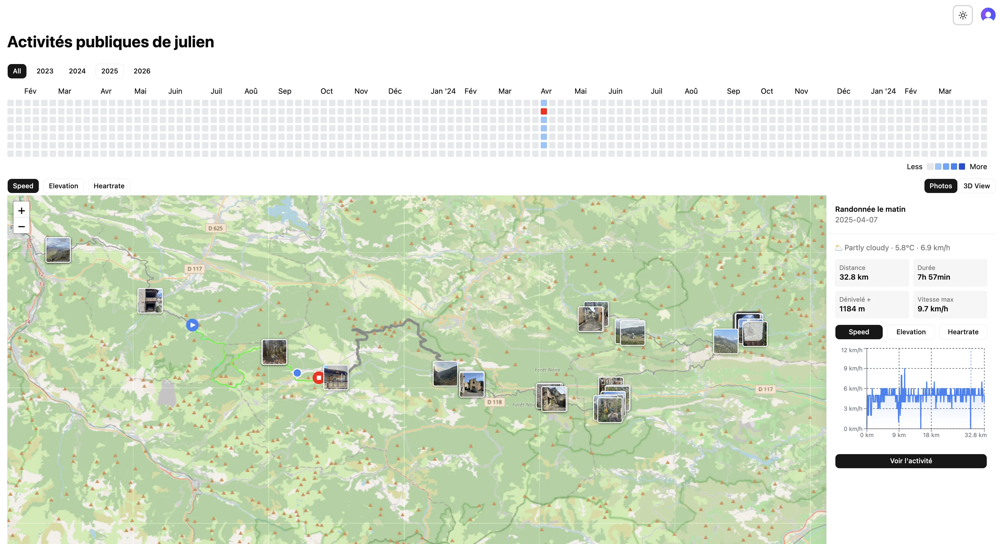

# Couloir

**Live:** [couloir.work](https://www.couloir.work)

A personal activity tracker for outdoor sports — skiing, surfing, trekking, and more. Upload GPS files from any device or sync directly from Strava, and visualize all your activities on an interactive map with elevation and speed charts.



## Features

- Upload `.fit` files from GPS devices
- Sync activities from Strava (OAuth + background sync with real-time WebSocket progress)
- Strava webhook — new activities appear automatically when recorded
- Interactive map with multi-activity overlay and hover to explore each track
- Speed heatmap — track segments colored by speed (blue → green → yellow → red)
- Cluster view at low zoom, switches to heatmap tracks when zoomed in with viewport-based lazy loading
- Elevation and speed charts synced with the map cursor
- Activity list with filtering, sorting, and infinite scroll
- Bulk selection and delete
- Stats page with distance per month chart and personal records
- Public profile at `couloir.work/u/[username]` — shareable activity map with activity heatmap calendar, date range selection, and map↔calendar sync
- Immich integration — GPS-tagged photos synced from a self-hosted Immich instance, displayed as markers on the map at their capture location with thumbnail popups
- Dark/light mode with adaptive map tiles (Stadia Alidade Smooth Dark / OpenStreetMap)

## Roadmap

- [ ] **Summit detection** — detect elevation peaks across activity tracks, reverse geocode to get peak names, display summit count on profile and markers on map
- [ ] **Life map** — photos + activities at all zoom levels with clustering, turning the map into a personal geographic history
- [ ] **Timeline scrubber** — replay geographic history month by month across activities and photos
- [ ] **Weather on activity** — show conditions at time of activity using Open-Meteo historical API (free, no key)
- [ ] **Personal records** — longest, highest, fastest, displayed on profile
- [ ] **Activity type tagging** — ski/hike/bike/surf labels with per-type colors on map
- [ ] **Route planning** — draw a route, get elevation profile, export as GPX
- [ ] **3D map view** — MapLibre GL JS with free terrain tiles, activity tracks rendered in 3D relief, toggle between 2D and 3D

## Tech Stack

**Frontend**
- [Next.js 15](https://nextjs.org/) — App Router, server components, Suspense streaming
- [TypeScript](https://www.typescriptlang.org/)
- [Tailwind CSS](https://tailwindcss.com/) + [shadcn/ui](https://ui.shadcn.com/)
- [TanStack Query](https://tanstack.com/query) — infinite scroll, optimistic updates
- [TanStack Table](https://tanstack.com/table) — sortable, filterable activity list
- [Zustand](https://zustand-demo.pmnd.rs/) — cross-component state (selection, hover, visible activity IDs)
- [react-activity-calendar](https://grubersjoe.github.io/react-activity-calendar/) — activity heatmap calendar
- [Recharts](https://recharts.org/) — elevation and speed charts
- [React Leaflet](https://react-leaflet.js.org/) — GPS track map
- [Clerk](https://clerk.com/) — authentication
- [Zod](https://zod.dev/) — schema validation

**Backend**
- [Node.js](https://nodejs.org/) + [Express](https://expressjs.com/)
- [TypeScript](https://www.typescriptlang.org/)
- [Drizzle ORM](https://orm.drizzle.team/) — type-safe queries
- [PostgreSQL](https://www.postgresql.org/) via [NeonDB](https://neon.tech/)
- [ws](https://github.com/websockets/ws) — WebSocket server for real-time sync progress
- [Clerk](https://clerk.com/) — JWT verification

**Infrastructure**
- [Vercel](https://vercel.com/) — frontend
- [Railway](https://railway.app/) — backend
- [NeonDB](https://neon.tech/) — serverless Postgres
- [Immich](https://immich.app/) — self-hosted photo library, GPS photos synced via API
- [Playwright](https://playwright.dev/) — end-to-end tests

## Architecture

Monorepo with two separate deployments:

```
couloir/
├── client/   # Next.js app → Vercel
└── server/   # Express API + WebSocket server → Railway
```

Authentication is handled by Clerk. The client sends requests to the Express API with a JWT, verified server-side via `@clerk/express`. WebSocket connections authenticate the same way using a token passed as a query parameter.

GPS streams are simplified by enforcing a maximum distance between consecutive points, ensuring smooth speed heatmap rendering without storing redundant data.

Strava sync runs as a background job on the server, streaming progress back to the client over a WebSocket connection authenticated with a Clerk JWT. A Strava webhook subscription pushes new activity events to the server in real time, so activities appear without manual sync.

## Local Development

**Prerequisites:** Node.js 20+, pnpm, a PostgreSQL database (or NeonDB)

```bash
# Clone
git clone https://github.com/jpetits/couloir.git
cd couloir

# Server
cd server
cp .env.example .env   # fill in DATABASE_URL, CLERK_SECRET_KEY, STRAVA_*
pnpm install
pnpm db:push
pnpm dev

# Client (separate terminal)
cd client
cp .env.example .env   # fill in NEXT_PUBLIC_API_URL, CLERK keys
pnpm install
pnpm dev
```
